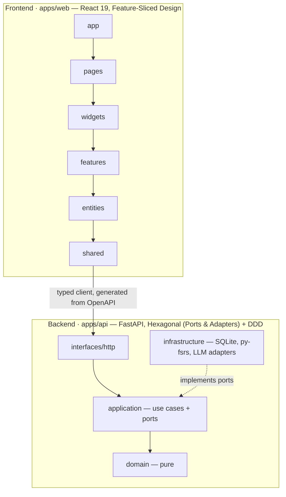

# Vocab Trainer

A personal, spaced-repetition English vocabulary trainer built as a full-stack showcase.
Import your own word lists, review them on an **FSRS** schedule, and (roadmap) practise
building sentences with LLM feedback and pronunciation.

The point of this repo is the **engineering**, not the feature count: a strictly-layered
**Hexagonal + DDD** backend and a **Feature-Sliced Design** frontend, both with enforced
architectural boundaries, strict typing, and tests.

> **Status:** backend and frontend are built, tested, and merged. LLM sentence-practice +
> pronunciation are the next milestone (see [Roadmap](#roadmap)).

## The learning loop

**Import** a word list (CSV or markdown, with a dry-run preview) → **review** due cards with
FSRS (reveal → rate `Again / Hard / Good / Easy`, mouse or keys `1`–`4`) → track **stats** →
*(next)* **practise** sentences with live feedback and **pronunciation**.

## Architecture



- **Backend — Hexagonal + DDD.** The `domain` layer is framework-free; `application` depends
  only on ports (interfaces); adapters (SQLModel repositories, the py-fsrs scheduler, the
  LLM provider) are wired only in the composition root. FSRS scheduling lives behind a
  `Scheduler` port; the LLM behind an `LlmProvider` port switchable between Claude API, a
  local Ollama model, or none.
- **Frontend — Feature-Sliced Design.** Imports flow strictly downward
  `app → pages → widgets → features → entities → shared`, every slice exposed through a
  public `index.ts`. Data access is TanStack Query over a **typed `openapi-fetch` client
  generated from the backend's OpenAPI schema**.

Both boundary systems are **enforced in CI** — `import-linter` on the backend, `Steiger` on
the frontend — so the architecture can't silently rot.

## Tech stack

| | |
|---|---|
| **Backend** | Python 3.12 · FastAPI · SQLModel + SQLite (async) · py-fsrs · Pydantic v2 · uv |
| **Frontend** | React 19 · TypeScript (strict) · Vite · Tailwind + shadcn/ui · TanStack Query |
| **Contracts** | OpenAPI → generated `openapi-fetch` client |
| **Quality** | mypy `--strict`, Ruff, import-linter · `tsc` strict, Biome, Steiger |
| **Tests** | pytest + httpx · Vitest + Testing Library + MSW · Playwright |

## Repository layout

```
apps/
  api/    FastAPI backend (domain / application / infrastructure / interfaces / config)
  web/    React frontend (app / pages / widgets / features / entities / shared)
docs/superpowers/   design specs and implementation plans
CONTRIBUTING.md     engineering standards (CI-enforced)
```

## Quick start

Prerequisites: [uv](https://docs.astral.sh/uv/) and [pnpm](https://pnpm.io/).

```bash
# 1) Backend  → http://localhost:8000  (API docs at /docs)
cd apps/api
uv sync
uv run uvicorn vocab_api.main:app --reload

# 2) Frontend → http://localhost:5173  (dev server proxies /api → :8000)
cd apps/web
pnpm install
pnpm dev
```

## Checks

```bash
# backend
cd apps/api && uv run ruff check . && uv run mypy && uv run lint-imports && uv run pytest -q
# frontend
cd apps/web && pnpm lint && pnpm typecheck && pnpm test && pnpm fsd && pnpm build
```

## Roadmap

- [x] Backend — decks, import (dry-run + commit), FSRS review queue, record review, stats
- [x] Frontend — deck picker, import, review session, stats
- [ ] LLM sentence practice — construct a sentence with a word, get grammar/naturalness feedback
- [ ] Pronunciation — reference TTS + speech-to-text self-check
- [ ] Pluggable LLM provider — Claude API / local Ollama / none

## Design docs

Architecture and step-by-step build plans live in
[`docs/superpowers/`](docs/superpowers/). Engineering standards are in
[`CONTRIBUTING.md`](CONTRIBUTING.md).
